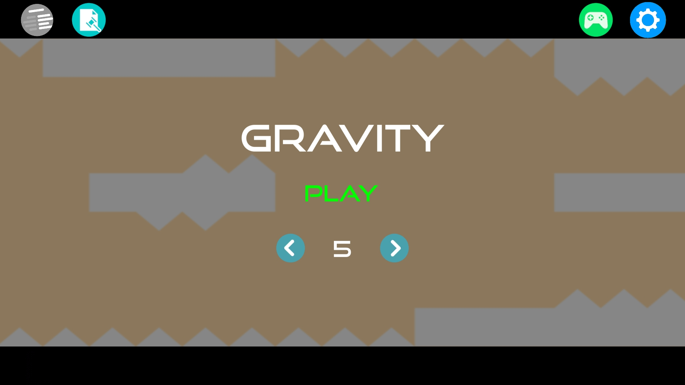
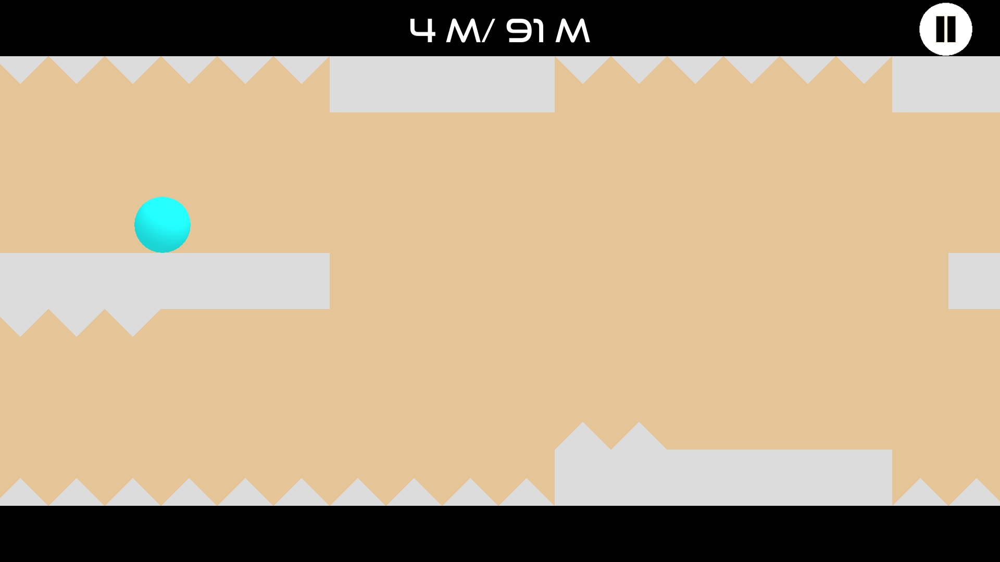
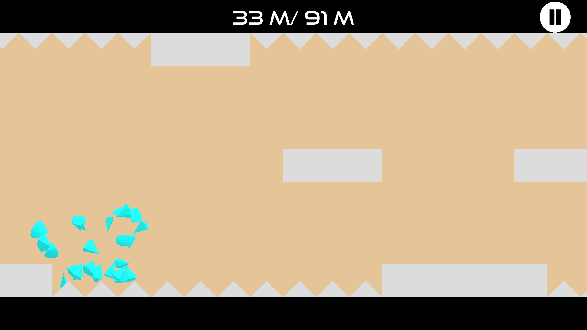
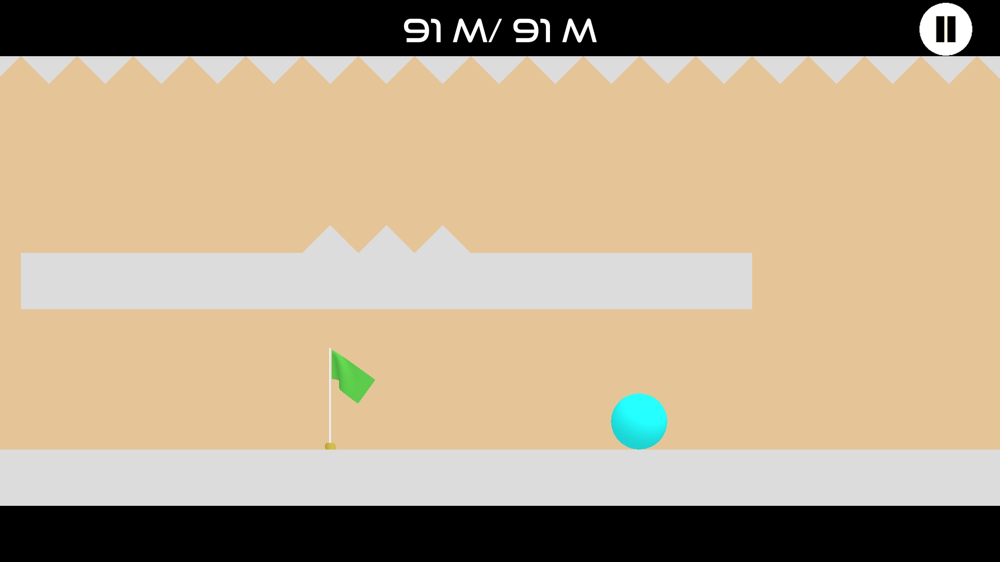

# Gravity
 

A hypercasual, one-tap, side-scrolling game where the player will have to switch gravity from downwards or upwards in order to evade obstacles and the void. A game with simple mechanics but requires patience and well-timed taps in order to complete the level.

 

## Gameplay
* The only mechanic here is tapping on the screen to switch the gravity.
* Time your taps so that you don't end up in a spike.
* Patience is key, don't be too hasty. Tapping too quickly can be detrimental.

 

## Features
* Google Play Games Service integration.
* Game data saved using both local device storage and cloud storage through Google Drive (no data is collected or used on our end).
* Google Ad-Mob integration (no other ad networks implemented). Banner, interstitial ads are implemented throughout the game.
* Achievements integrated through Google Play Games Service!

 

## Technical Features
* Ball shatters using basic physics.
* Gravity simulated by adding an upwards or downwards force on the ball. 
* The entire map is one mesh. Initially made up of individual cubes, spikes and such, the game then will combine the map into one mesh. However, this method may be causing some performance issues. Another method is to pool objects again and move the objects into position when it is about to appear on the map.
* The map is initially created in a text document and parsed by the game. The maps can be view by a text editor and are located [in this folder](./Assets/StreamingAssets/MapData).

 

## Screenshots

 

## Notes:
* Was previously released to the Google Play Store, but is no longer available.

 

## License:
* © 2018-2022 Victor Dang All Rights Reserved
* You may download and modify this project for educational and non-commerical use.